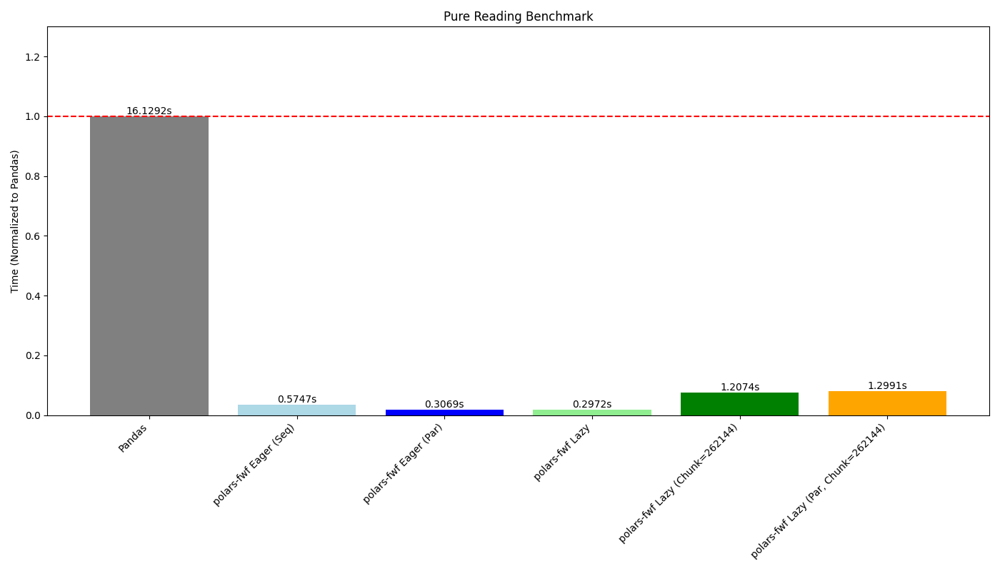
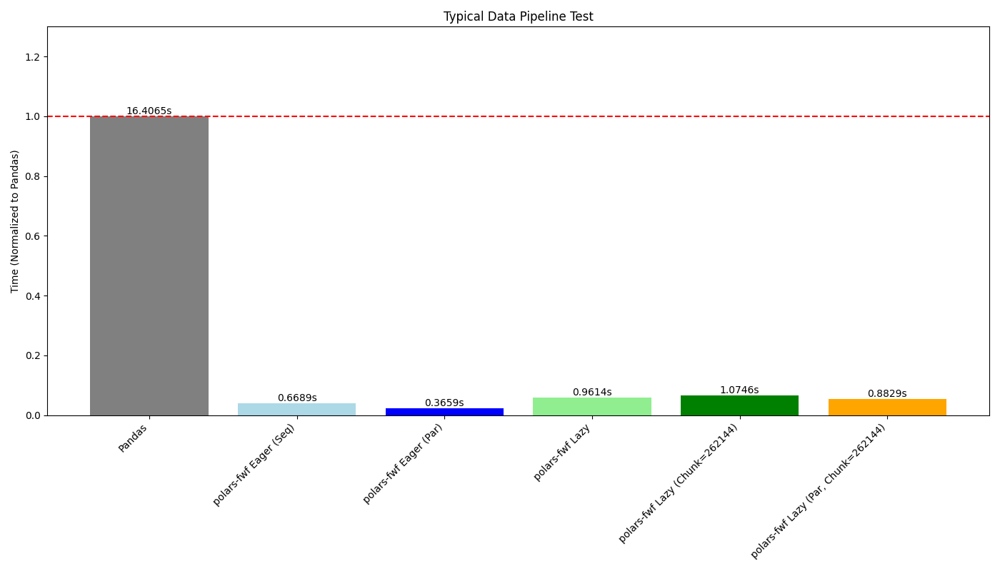
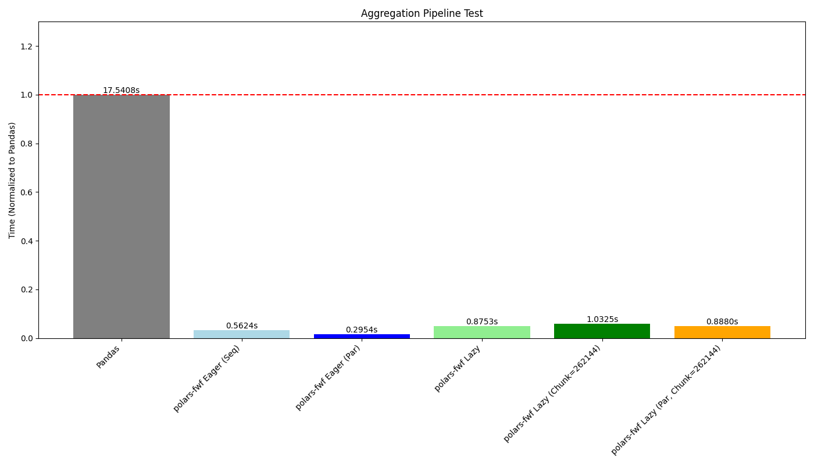

# polars-fwf

`polars-fwf` provides a fast Fixed-Width File (FWF) parser for [Polars](https://pola.rs/). It uses a Rust core with Rayon for multi-threading and the Arrow C Data Interface for zero-copy data transfer into Polars DataFrames and LazyFrames.

## Why Fixed-Width?

While formats like CSV are more common, Fixed-Width Files (FWF) provide a more robust **data contract** for high-integrity B2B exchanges:

- **Structural Integrity**: Unlike CSV, FWF is immune to "delimiter collision" and "quote hell." Comma, quotes, or newlines within a field cannot break the physical layout of the file.
- **Predictable Performance**: Because column positions are known at the byte level, parsers can slice data with near-zero overhead.
- **Consistency**: The fixed schema ensures that if a spec defines a column as 10 bytes, it remains 10 bytes. This prevents the "silent misalignment" often caused by poorly escaped CSVs.

`polars-fwf` brings the reliability of these legacy contracts into the modern Polars ecosystem with native-speed parsing.

## Usage

The package provides `read_fwf` for eager execution and `scan_fwf` for lazy execution.

```python
import polars as pl
import polars_fwf as pfwf

# 1. Define field specifications
# padding=None (default) strips all ASCII whitespace.
# padding=ord('0') would strip only leading/trailing zeros.
# Note: Numeric parsers handle leading zeros automatically.
specs = [
    pfwf.FieldSpec("id", offset=0, length=5, dtype=pfwf.DType.I32),
    pfwf.FieldSpec("val", offset=5, length=10, dtype=pfwf.DType.F64),
    pfwf.FieldSpec("tag", offset=15, length=5, dtype=pfwf.DType.String, padding=ord(" ")),
]

# 2. Eager parsing (returns pl.DataFrame)
df = pfwf.read_fwf("data.fwf", specs)

# 3. Lazy parsing (returns pl.LazyFrame)
lazy_df = pfwf.scan_fwf("data.fwf", specs)
result = lazy_df.filter(pl.col("val") > 100.0).group_by("tag").count().collect()
```

### Supported Data Types

Supported `pfwf.DType` members:
- **Integers**: `I8`, `I16`, `I32`, `I64`, `U8`, `U16`, `U32`, `U64`
- **Floats**: `F32`, `F64` (supports `NaN` and `inf`)
- **Strings**: `String` (mapped to Polars `String`)

## Benchmarks

The following benchmarks compare `polars-fwf` against `pandas.read_fwf` (v2.2.3) using a synthetic dataset of 200,000 rows and 200 columns (~430MB).

### Pure Reading


### Typical Data Pipeline
Filtering by multiple columns and selecting a subset of data.


### Aggregation Pipeline
Filtering followed by a `group_by` and multiple aggregations.


## Building Locally

To build and install the package locally from source during development:

```bash
# Clone the repository
git clone <repo-url>
cd polars-fwf

# Create a virtual environment
uv venv
source .venv/bin/activate

# Install the package in editable mode with development dependencies
uv pip install -e ".[dev]"

# Build the Rust extension
# For maximum performance, compile with native CPU optimizations:
RUSTFLAGS="-C target-cpu=native" maturin develop --release
```

## AI Assistance Disclosure

This project uses AI-assisted development with Gemini.
